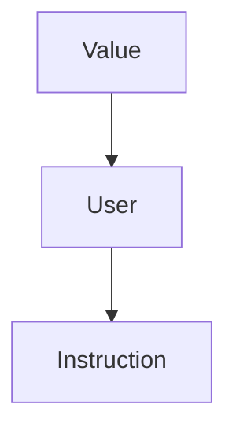

# Assignment 2

## Prerequisiti

· Ricorda il seguente schema di classi:



· Ricordati che:

- *Foo-optimized.bc* è il file binario generato
- *Loop.ll* è il file(IR) che stiamo ottimizando

· Ricordati che per compilare:

- `make opt (/BUILD)`
- `make -j16 install (/BUILD)`
- `INSTALL/bin/opt -p localopts TEST/Foo.ll -o Foo-optimized.bc`


## Consegna

• A partire dal codice della precedente esercitazione implementare un passo di Loop-Invariant Code Motion (LICM).


## Steps

1. Seguire lo step di inizializzazione in <b>Esercitazione5</b>

2. Cambiare il codice di <b> LoopPasses.cpp </b>

```c++

//===-- LocalOpts.cpp - Example Transformations --------------------------===//
//
// Part of the LLVM Project, under the Apache License v2.0 with LLVM Exceptions.
// See https://llvm.org/LICENSE.txt for license information.
// SPDX-License-Identifier: Apache-2.0 WITH LLVM-exception
//
//===----------------------------------------------------------------------===//

#include "llvm/Transforms/Utils/LoopPasses.h"
#include "llvm/IR/Instructions.h"
#include "llvm/IR/InstrTypes.h"
#include <llvm/IR/Constants.h>

using namespace llvm;


// %d = %s1 + %s2 -> isLoopInvariant of %s1  and isLoopInvariant of %s2

bool is_loop_invariant(Value *Operand){  //Not sure of the parameter
    return false;
}

bool is_define_outside(Value *Operand , Loop &L){
    Instruction* I_temp = dyn_cast<Instruction>(Operand);
    if(I_temp != NULL){
        return (L.contains(I_temp->getParent()));
    }else{
        return false;
    }
}

// Verifica se un operando è una costante.
bool is_costant(Value *Operand){
    if (ConstantInt *C = dyn_cast<ConstantInt>(Operand)) {
        return true;
    }else{
        return false;
    }
}

PreservedAnalyses LoopPasses::run(Loop &L, LoopAnalysisManager &LAM , LoopStandardAnalysisResults &LAR, LPMUpdater &LU){

    outs() << "Starting loop programm: \n\n";

    std::vector<Instruction*> loop_invariant_instructions;

    if(!L.isLoopSimplifyForm()){
    outs()<<"\n il Loop non è in forma normale \n" ;
        return PreservedAnalyses::all();
    }

    
    outs()<<"\n Il loop è in forma Normale si può continuare nell'ottimizazione... \n";
    BasicBlock *head = L.getHeader();

    //recuperiamo l'handle alla funzione che contiene il Loop
    Function *F = head->getParent();

    //stampo il CFG
    outs()<<"-----CFG------ \n";
    int cont=0;
    for(auto iter = F->begin() ; iter != F->end() ;++iter){
        outs()<<"Basic Block("<<cont++<<") : " << "\n" ;
        BasicBlock &BB = *iter;
        outs()<<BB<<"\n";
    }

    outs()<<"---- fine ----- ";


    //Stampo il Loop
    outs()<<"\n\n---- IL LOOP ------ \n";
    cont=0;


    // TODO -> provare a rendere questo ciclo for nella modalità for(auto &B : L)...
    for( auto BI = L.block_begin() ; BI != L.block_end(); ++BI){
        
        outs()<<"Basic Block("<<cont++<<") : " << "\n" ;
        BasicBlock &BB = **BI;    
        outs()<<BB << "\n" ;
        
        for (auto &I : BB) {
            outs()<<"Analisi dell'istruzione : "<<I<<" : \n";
            bool isOk=true;
            for (auto *Iter = I.op_begin(); Iter != I.op_end(); ++Iter) {
                Value *Operand = *Iter;
                
                if(is_costant(Operand)){
                    outs()<<"è costante!\n";
                }else if(is_define_outside(Operand,L)){
                    outs()<<"è definita esternamente\n";
                }else{
                    isOk = false;  // TODO fare check se l'istruzione contente questo Value è loop_invariant o meno. In tal caso isOk rimane inviariato
                    outs()<<"è definita internamente\n";
                }

            }
            if(isOk == false){
                loop_invariant_instructions.push_back(&I);
            }
        }
    }


    outs()<<"Loop invariant instructions : \n";
    for(int i=0 ; i<loop_invariant_instructions.size() ; i++){
        outs()<<*loop_invariant_instructions[i]<<"\n";
    }

    return PreservedAnalyses::all();
}

```

3. Cambiare il codice di <b> LoopPasses.h </b>

```c++
//TODO -> Copiare qui dal sorgente su LLVM
```


