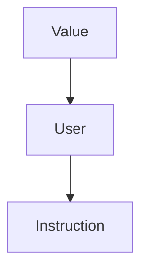

# Assignment 2

## Prerequisiti

· Ricorda il seguente schema di classi:



· Ricordati che:

- *Foo-optimized.bc* è il file binario generato
- *Loop.ll* è il file(IR) che stiamo ottimizando

· Ricordati che per compilare:

- `make opt (/BUILD)`
- `make -j16 install (/BUILD)`
- `INSTALL/bin/opt -p localopts TEST/Foo.ll -o Foo-optimized.bc`


## Consegna

• A partire dal codice della esercitazione 4, implementare un passo di Loop-Invariant Code Motion (LICM).


## Steps

1. Seguire lo step di inizializzazione in <b>Esercitazione4</b>

2. Generare il file .ll nel seguente modo:

    ```bash
    echo "Avvio scripting per creazione MEM2REG file"
    INSTALL/bin/clang -S -emit-llvm -O0 TEST/source_c_files/LICM.c -o LICM_no_opt.ll -Xclang -disable-O0-optnone
    INSTALL/bin/opt -p=mem2reg LICM_no_opt.ll -o LICM_no_opt.bc 
    INSTALL/bin/llvm-dis LICM_no_opt.bc -o LICM.ll
    echo "Script terminato, risultato salvato in LICM.ll"
    echo "Eliminazione file intermedi"
    rm LICM_no_opt.bc
    rm LICM_no_opt.ll
    ```

3. Commentare le righe che incominciano con `attributes #...`

4. Cambiare il codice di <b> LoopPasses.cpp </b>

    ```c++

    #include "llvm/Transforms/Utils/LoopPasses.h"
    #include "llvm/IR/Instructions.h"
    #include "llvm/IR/InstrTypes.h"
    #include <llvm/IR/Constants.h>

    using namespace llvm;


    // Verifica se un istruzione è stata definita esternamente.
    bool is_define_outside(Value *Operand , Loop &L){
        Instruction* I_temp = dyn_cast<Instruction>(Operand);
        if(I_temp != NULL){
            return (L.contains(I_temp->getParent()));
        }else{
            return false;
        }
    }

    // Verifica se un operando è una costante.
    bool is_costant(Value *Operand){
        if (ConstantInt *C = dyn_cast<ConstantInt>(Operand)) {
            return true;
        }else{
            return false;
        }
    }

    PreservedAnalyses LoopPasses::run(Loop &L, LoopAnalysisManager &LAM , LoopStandardAnalysisResults &LAR, LPMUpdater &LU){

        outs() << "Starting loop programm: \n\n";

        std::set<Instruction*> loop_invariant_instructions;

        if(!L.isLoopSimplifyForm()){
        outs()<<"\n il Loop non è in forma normale \n" ;
            return PreservedAnalyses::all();
        }
        outs()<<"\n Il loop è in forma Normale si può continuare nell'ottimizazione... \n";

        BasicBlock *head = L.getHeader();
        Function *F = head->getParent(); //recuperiamo l'handle alla funzione che contiene il Loop

        //stampo il CFG
        outs()<<"-----CFG------ \n";
        int cont=0;
        for(auto iter = F->begin() ; iter != F->end() ;++iter){
            outs()<<"Basic Block("<<cont++<<") : " << "\n" ;
            BasicBlock &BB = *iter;
            outs()<<BB<<"\n";
        }
        outs()<<"---- fine ----- ";

        //Stampo il Loop
        outs()<<"\n\n---- IL LOOP ------ \n";
        cont=0;

        // TODO -> provare a rendere questo ciclo for nella modalità for(auto &B : L)...
        for( auto BI = L.block_begin() ; BI != L.block_end(); ++BI){
            
            outs()<<"Basic Block("<<cont++<<") : " << "\n" ;
            BasicBlock &BB = **BI;    
            outs()<<BB << "\n" ;
            
            for (auto &I : BB) {
                outs()<<"Analisi dell'istruzione : "<<I<<" : \n";
                bool isLoopInvariant=true;
                for (auto *Iter = I.op_begin(); Iter != I.op_end(); ++Iter) {
                    Value *Operand = *Iter;
                    
                    if(is_costant(Operand)){
                        outs()<<"è costante!\n";
                    }else if(is_define_outside(Operand,L)){
                        outs()<<"è definita esternamente\n";
                    }else{
                        Instruction* I_link = dyn_cast<Instruction>(Operand);
                        outs()<<"è definita internamente\n";
                        if(I_link == NULL || !(loop_invariant_instructions.count(I_link) > 0) )
                            isLoopInvariant = false;  
                    }
                }
                if(isLoopInvariant == true){
                    loop_invariant_instructions.insert(&I);
                }
            }
        }


        outs()<<"Loop invariant instructions : \n";
        for (const auto& element : loop_invariant_instructions) {
            outs()<<*element<<"\n";
        }

        return PreservedAnalyses::all();
    }
    
    ```

5. Cambiare il codice di <b> LoopPasses.h </b>

    ```c++
    #ifndef LLVM_TRANSFORMS_LOOPPASSES_H
    #define LLVM_TRANSFORMS_LOOPPASSES_H

    #include "llvm/IR/PassManager.h"
    #include "llvm/Transforms/Scalar/LoopPassManager.h"


    namespace llvm {
        class LoopPasses : public PassInfoMixin<LoopPasses> {
            public:
            PreservedAnalyses run(Loop &L, LoopAnalysisManager &LAM , LoopStandardAnalysisResults &LAR, LPMUpdater &LU);
        };
    } // namespace llvm


    #endif // LLVM_TRANSFORMS_TESTPASS _H

    ```


