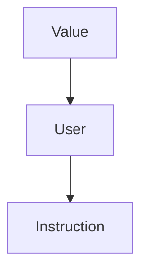
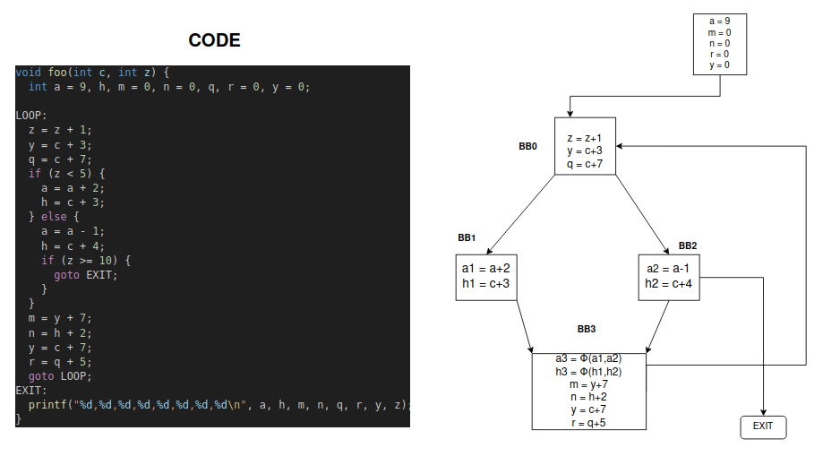
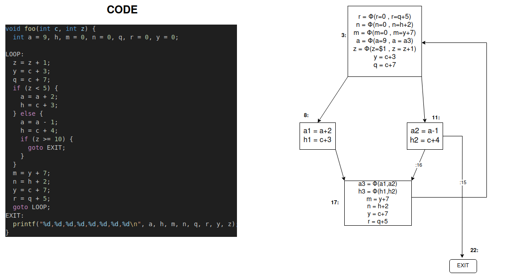
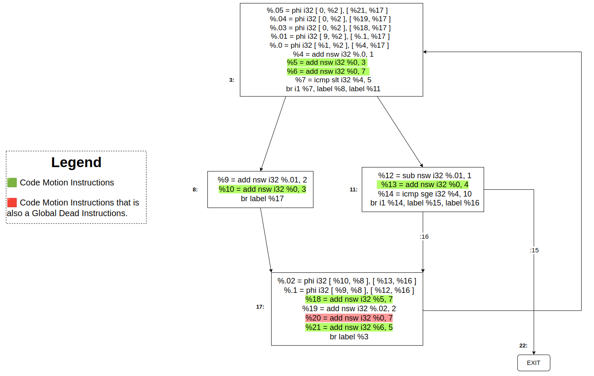

# Assignment 3

## Prerequisiti

· Ricorda il seguente schema di classi:




---

### Control Flow Graph of .ll code (No mem2reg opt) --- [C style]

</img>  

<br><br>

---

### Control Flow Graph of .ll code (with mem2reg opt) --- [C style]

<br>

</img>   
<br><br>

### Control Flow Graph of .ll code (with mem2reg opt) --- [IR style]

<br>

</img>   
<br><br><br>

## Consegna

• A partire dal codice della esercitazione 4, implementare un passo di Loop-Invariant Code Motion (LICM).


## Steps

1. Seguire lo step di inizializzazione in <b>Esercitazione4</b>

2. Generare il file .ll nel seguente modo:

    ```bash
    echo "Avvio scripting per creazione MEM2REG file"
    INSTALL/bin/clang -S -emit-llvm -O0 TEST/source_c_files/LICM.c -o LICM_no_opt.ll -Xclang -disable-O0-optnone
    INSTALL/bin/opt -p=mem2reg LICM_no_opt.ll -o LICM_no_opt.bc 
    INSTALL/bin/llvm-dis LICM_no_opt.bc -o LICM.ll
    echo "Script terminato, risultato salvato in LICM.ll"
    echo "Eliminazione file intermedi"
    rm LICM_no_opt.bc
    rm LICM_no_opt.ll
    ```

3. Commentare le righe che incominciano con `attributes #...`

4. Cambiare il codice di <b> LoopPasses.cpp </b>

    ```c++
    #include "llvm/Transforms/Utils/LoopPasses.h"
    #include "llvm/IR/Instructions.h"
    #include "llvm/IR/InstrTypes.h"
    #include <llvm/IR/Constants.h>
    #include "llvm/IR/Dominators.h"


    using namespace llvm;


    // Verifica se un istruzione è stata definita esternamente.
    bool isDefineOutside(Value *Operand , Loop &L){
        Instruction* I_temp = dyn_cast<Instruction>(Operand);
        if(I_temp != NULL){
            return !(L.contains(I_temp->getParent()));
        }else{
            return false;
        }
    }

    // Verifica se un operando è una costante.
    bool isCostant(Value *Operand){
        if (ConstantInt *C = dyn_cast<ConstantInt>(Operand)) {
            return true;
        }else{
            return false;
        }
    }

    // Verifica se un operando è valido per rendere l'istruzione Loop Invariant
    bool isLoopInvariantCandidate(Value *Operand , Loop &L , std::set<Instruction*> code_motions_candidates){
        Instruction* I_link = dyn_cast<Instruction>(Operand);
        return( isCostant(Operand) || 
                isDefineOutside(Operand,L) || 
                I_link != NULL || 
                (code_motions_candidates.count(I_link) > 0) || 
                (isa<Argument>(Operand))  );
    }

    // Trova i blocchi di uscita del ciclo
    std::set<BasicBlock *> find_exit_blocks(Loop &L)
    {
        std::set<BasicBlock *> exit_blocks;
        for (BasicBlock *BB : L.blocks())
        {
            for (Instruction &I : *BB)
            {
                if (BranchInst *BI = dyn_cast<BranchInst>(&I))
                {
                    for (unsigned i = 0; i < BI->getNumSuccessors(); ++i)
                    {
                        BasicBlock *succ = BI->getSuccessor(i);
                        if (!L.contains(succ))
                        {
                            exit_blocks.insert(succ);
                        }
                    }
                }
            }
        }
        return exit_blocks;
    }

    // Trova i blocchi che dominano TUTTE le uscite
    std::set<BasicBlock *> find_exit_dominators(DominatorTree &DT, Loop &L)
    {
        std::set<BasicBlock *> exit_blocks = find_exit_blocks(L);
        std::set<BasicBlock *> exit_dominators;

        for (BasicBlock *BB : L.blocks())
        {
            bool dominates_all_exits = true;

            for (BasicBlock *exitBlock : exit_blocks)
            {
                if (!DT.dominates(BB, exitBlock))
                {
                    dominates_all_exits = false;
                    break;
                }
            }
            if (dominates_all_exits)
            {
                exit_dominators.insert(BB);
            }
        }
        return exit_dominators;
    }

    // Controlla se un'istruzione domina TUTTI i suoi usi
    // TODO: NON può essere passata su un'istruzione che non sia binaria (?), aggiungi controlli
    // Dubbio : Ma non dovresti controllare i blocchi anzichè gli usi?
    bool instruction_dominates_all_uses(Instruction *I, DominatorTree &DT,
                                        Loop &L)
    {
        for (User *U : I->users()){
            Instruction *userInst = dyn_cast<Instruction>(U);
            if (userInst && L.contains(userInst->getParent())){
                if (!DT.dominates(I, userInst)){
                    return false;
                }
            }
        }
        return true;
    }

    // TODO: check se non istruzione binaria
    bool is_dead(Instruction *I, Loop &L){
        for (User *U : I->users()){
            Instruction *userInst = dyn_cast<Instruction>(U);
            if (userInst && !L.contains(userInst->getParent())){
                return false;
            }
        }
        return true;
    }

    // Sposta un set di istruzioni nel preheader
    void move_to_preheader(Loop *L,
                        std::set<Instruction *> &loop_invariant_instructions)
    {
        BasicBlock *preheader = L->getLoopPreheader();
        Instruction *terminator = preheader->getTerminator();

        for (Instruction *inst : loop_invariant_instructions)
        {
            inst->moveBefore(terminator);
        }

        outs() << "Moved Loop Invariant Instructions to preheader!\n";
    }


    PreservedAnalyses LoopPasses::run(Loop &L, LoopAnalysisManager &LAM , LoopStandardAnalysisResults &LAR, LPMUpdater &LU){

        outs() << "Starting loop programm: \n\n";

        std::set<Instruction*> code_motions_candidates;
        std::set<BasicBlock*> loop_exits;

        if(!L.isLoopSimplifyForm()){
        outs()<<"\n il Loop non è in forma normale \n" ;
            return PreservedAnalyses::all();
        }
        outs()<<"\n Il loop è in forma Normale si può continuare nell'ottimizazione... \n";

        BasicBlock *head = L.getHeader();
        Function *F = head->getParent(); 

        //stampo il CFG
        outs()<<"-----CFG------\n\n";
        for(auto iter = F->begin() ; iter != F->end() ;++iter){
            
            BasicBlock &BB = *iter;
            outs()<<"---------------------------------------\n"; 
            outs()<<BB<<"\n";
            outs()<<"---------------------------------------\n \n\n"; 
        }
        outs()<<"---- END ----- ";

        //Print of the loop
        outs()<<"\n\n---- IL LOOP ------ \n";
        
        //Find exit of the loop and loop invariant instructions
        for( auto BI = L.block_begin() ; BI != L.block_end(); ++BI){
            
            BasicBlock &BB = **BI;
            outs()<<"---------------------------------------\n";  
            outs()<<BB << "\n" ;
            outs()<<"---------------------------------------\n\n";  
            
            for (auto &I : BB) {
                outs()<<"Analysis of the instruction : "<<I<<" : \n";
                bool isLoopInvariant=true;
                PHINode* phi_node = dyn_cast<PHINode>(&I);
                
                //Check if is phi_instruction
                if(phi_node){
                    isLoopInvariant = false;
                //Chech if is branch_instruction
                }else if (isa<BranchInst>(I)) {
                    isLoopInvariant = false;
                    for (auto *Iter = I.op_begin(); Iter != I.op_end(); ++Iter) {
                        Value *Operand = *Iter;
                        outs()<<"op_branch : "<<*Operand<<"\n";
                        BasicBlock *BB_temp = dyn_cast<BasicBlock>(Operand);
                        if (BB_temp && !L.contains(BB_temp)) {
                            loop_exits.insert(BB_temp);
                        } 
                    }
                }else{
                    for (auto *Iter = I.op_begin(); Iter != I.op_end(); ++Iter) {
                        Value *Operand = *Iter;
                        outs()<<"op : "<<*Operand<<"\n";
                        //Check of the operand
                        if(! isLoopInvariantCandidate(Operand , L , code_motions_candidates)){
                            isLoopInvariant = false;
                        }
                    }
                }
                if(isLoopInvariant == true){
                    code_motions_candidates.insert(&I);
                }
            }
            outs()<<"\n\n";
        }

        //Creation of Dominance Tree
        DominatorTree &DT = LAR.DT;
        BasicBlock *BB = (DT.getRootNode())->getBlock();

        //Filter based on Domination of Exit BB, Domination of all Uses
        for (const auto& exit_iterator : loop_exits) {
            BasicBlock* Exit_BB = dyn_cast<BasicBlock>(exit_iterator);
            
            for (auto it = code_motions_candidates.begin(); it != code_motions_candidates.end();) {
                Instruction* I = *it;
                BasicBlock* BB = I->getParent();
                
                bool isDominated = DT.dominates(BB, Exit_BB);  // BB Domina Exit_BB
                
                //Dead Check
                if(is_dead(I , L)){
                    outs()<<*I<<" TO DELETE "<<*Exit_BB<<"\n";
                    it = code_motions_candidates.erase(it);
                }
                //Domination of all Uses
                else if(instruction_dominates_all_uses(I , DT , L)){
                    outs()<<*I<<" TO DELETE "<<*Exit_BB<<"\n";
                    it = code_motions_candidates.erase(it);
                }
                // Domination of Exit BB
                else if(isDominated){     
                    outs()<<*I<<" fa parte di un BasicBlock che domina l'uscita "<<*Exit_BB<<"\n";
                }else{
                    outs()<<*I<<" TO DELETE "<<*Exit_BB<<"\n";
                    it = code_motions_candidates.erase(it);
                }
                ++it;
            } 
        }

        //Lists of Loop Code Motion Instructions
        outs()<<"\n\nLoop Code Motion instructions : \n";
        for (const auto& element : code_motions_candidates) {
            outs()<<*element<<"\n";
        }   

        //Lists of Exits BasicBlocks
        outs()<<"\n\nExits BasicBlocks : \n";
        for (const auto& element : loop_exits) {
            outs()<<*element<<"\n";
        }

        //Move instruction to PREHEADER
        //outs() << "\nAttempting to move instructions...\n";
        //move_to_preheader(&L, code_motions_candidates);

        return PreservedAnalyses::all();
    }


    
    ```

5. Cambiare il codice di <b> LoopPasses.h </b>

    ```c++
    #ifndef LLVM_TRANSFORMS_LOOPPASSES_H
    #define LLVM_TRANSFORMS_LOOPPASSES_H

    #include "llvm/IR/PassManager.h"
    #include "llvm/Transforms/Scalar/LoopPassManager.h"


    namespace llvm {
        class LoopPasses : public PassInfoMixin<LoopPasses> {
            public:
            PreservedAnalyses run(Loop &L, LoopAnalysisManager &LAM , LoopStandardAnalysisResults &LAR, LPMUpdater &LU);
        };
    } // namespace llvm


    #endif // LLVM_TRANSFORMS_TESTPASS _H

    ```


