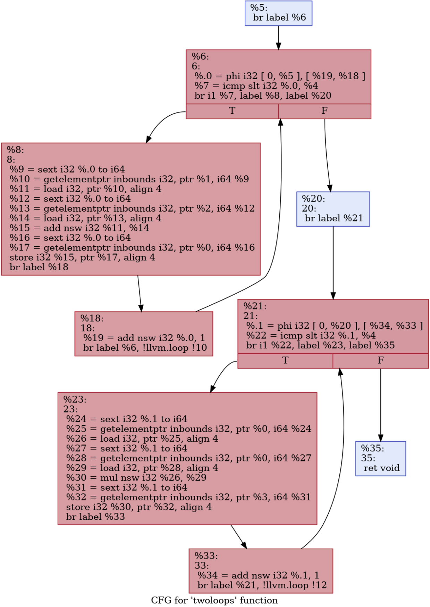

# Assignment 4

## Consegna

• Implementare un passo di Loop Fusion 

## Algoritmo per la Code Motion 

//TODO


## Rappresentazione grafica del problema

</img>


## Steps

1. Seguire lo step di inizializzazione del passo in <b>Esercitazione4</b>

    - ⚠ Ricordati che questo assignment richiede un <b>FUNCTION_PASS</b>

2. Generare il file .ll nel seguente modo:

    ```bash
    INSTALL/bin/clang -S -emit-llvm -O0 TEST/source_c_files/Loop_fusion.c -o LF.ll -Xclang -disable-O0-optnone
    # Eseguire mem2reg pass
    ```

3. Commentare le righe che incominciano con `attributes #...`

4. Modificare i file <b>LoopFusionPass.cpp</b> e <b>LoopFusionPass.h</b>

5. Lanciare i seguenti comandi:

    ```bash
    INSTALL/bin/opt -p loop_fusion TEST/LF.ll -o temp.bc
    INSTALL/bin/llvm-dis temp.bc -o LF_opt.ll
    rm temp.bc
    ```


