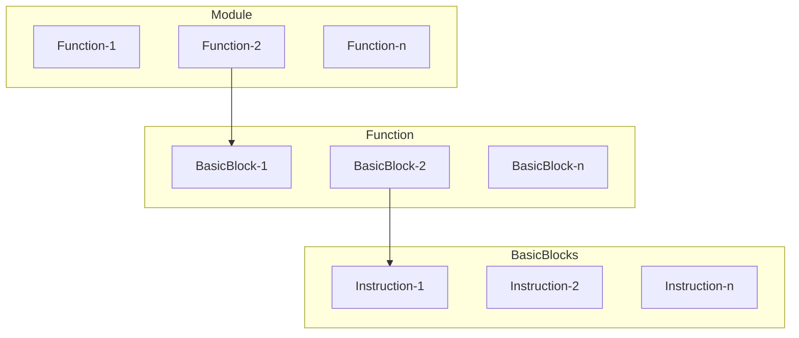

# ESERCITAZIONE 1

## ESERCIZIO 2

### Parte1

1.vai nella directory `/LLVM/SRC/llvm-project-llvmorg-17.0.6/llvm/include/llvm/Transforms/Utils$`

2.Aggiungi il file **TestPass.h**

```c++
#ifndef LLVM_TRANSFORMS_TESTPASS_H
#define LLVM_TRANSFORMS_TESTPASS_H

#include "llvm/IR/PassManager.h"
namespace llvm {
    class TestPass : public PassInfoMixin<TestPass> {
        public:
        PreservedAnalyses run(Function &F, FunctionAnalysisManager &AM);
    };
} // namespace llvm


#endif // LLVM_TRANSFORMS_TESTPASS _H
```

3.vai nella directory `/LLVM/SRC/llvm-project-llvmorg-17.0.6/llvm/lib/llvm/Transforms/Utils$`

4.Aggiungi il file **TestPass.cpp**

```c++
#include "llvm/Transforms/Utils/TestPass.h"
using namespace llvm;
PreservedAnalyses TestPass::run(Function &F,
FunctionAnalysisManager &AM) {
errs() << Questa funzione si chiama << F.getName() << "\n";
return PreservedAnalyses::all();
}
```

5.vai nella directory  ` /LLVM/SRC/llvm-project-llvmorg-17.0.6/llvm/lib/llvm/Transforms/Utils$ `

6.Modifichi il file CMakeList.txt e aggiungi il nome "TestPass.cpp" mettilo in ordine alfabetico

7.vai nella directory  `/LLVM/SRC/llvm-project-llvmorg-17.0.6/llvm/lib/Passes/PassRegistry.def`

8.Aggiungi questa riga "FUNCTION_PASS("testpass", TestPass())" al file **PassRegistry.def**
9.Aggiungi questa riga "#include "llvm/Transforms/Utils/TestPass.h"" al file **PassBuilder.cpp**

10.Vai in `/LLVM/BUILD/` e manda il comando `make opt` e successivamente `make install`

11.Andare in `/LLVM` e mandare il comando source `setup.sh`

12.Andare nella directory `LLVM/` e poi mandare il comando
`opt -passes=testpass TEST/Loop.bc \ -disable-output`

`INSTALL/bin/opt -passes=testpass TEST/Loop.ll -disable-output`

### ATTENZIONE  

1. modifica il file `/LLVM/setup.sh`    -> Controlla come fare
2. scrivere `source setup.sh`
3. manda `opt -passes=testpass TEST/Loop.ll -disable-output`

### Parte2

Consegna :

```text
- Estendete il passo TestPass di modo che analizzi la IR e
stampi alcune informazioni utili per ciascuna della funzioni
che compaiono nel programma di test : 

1.Nome
2.Numero di argomenti (‘N+*’ in caso di funzione variadica)(*)
3.Numero di chiamate a funzione nello stesso modulo
4.Numero di Basic Blocks
5.Numero di Istruzioni

Documentation on : < https://llvm.org/doxygen/classes.html >

```

! Ricordati il seguente schema !



1.Cambiare il file **TestPass.cpp** nel seguente modo : 

```c++
#include <llvm/IR/Instructions.h>   // Aggiungere questa direttiva

using namespace llvm;

PreservedAnalyses TestPass::run(Function &F,
                            FunctionAnalysisManager &AM) {
      
      // Calcolo numero BasicBlocks + numero Instructions
      unsigned n_bb = 0;
      unsigned n_ii = 0;
      unsigned n_ff = 0;
      for (auto iter = F.begin() ; iter != F.end() ; ++iter){
            BasicBlock &B = *iter;
            for (auto iter2 = B.begin() ; iter2 != B.end() ; ++iter2){
                  Instruction &I = *iter2;
                  n_ii++;
                  // Conta le chiamate a funzione
                  if ( CallInst *call_inst = dyn_cast<CallInst>(&I))
                        n_ff++;
            }
            n_bb ++;
      }

      //Stampa finale
      errs() <<"\n";
      errs() << "Questa funzione si chiama : " << F.getName() <<"\n";   //1.Nome
      errs() << "Numero di parametri : " << F.arg_size() <<"\n";  //2.Num.Parametri
      errs() << "Numero di chiamate a funzione nel modulo :  " << n_ff <<"\n";    //3. n_functions
      errs() << "Numero di basicBlocks :  " << n_bb <<"\n";    //4. n_basic_blocks
      errs() << "Numero di istruzioni :  " << n_ii <<"\n";    //5. n_instructions
      
      return PreservedAnalyses::all();
 
}
```

## ESERCIZIO 3

⬤ Consegna :

```text
Trasformare il Function Pass in un Module Pass,
preservando la sua funzionalità

Documentation on : < https://llvm.org/doxygen/classes.html >
```

1.Cambiare il file **TestPass.cpp**

2.Modificare `PreservedAnalyses TestPass::run(Function &F... -> Pres..(Module &M...)`

3.Mi da errore aiuto : 

```c++
PreservedAnalyses TestPass::run(Module &M,
                            AnalysisManager &AM) {
      
      
      //Itera ogni funzione del modulo
      for (auto iter_m = M.begin() ; iter_m != M.end() ; ++iter_m){
            Function &F = *iter_m;
            // Calcolo numero BasicBlocks + numero Instructions
            unsigned n_bb = 0;
            unsigned n_ii = 0;
            unsigned n_ff = 0;
            for (auto iter = F.begin() ; iter != F.end() ; ++iter){
                  BasicBlock &B = *iter;
                  for (auto iter2 = B.begin() ; iter2 != B.end() ; ++iter2){
                        Instruction &I = *iter2;
                        n_ii++;
                        // Conta le chiamate a funzione
                        if ( CallInst *call_inst = dyn_cast<CallInst>(&I))
                              n_ff++;
                  }
                  n_bb ++;
            }

            //Stampa finale
            errs() <<"\n";
            errs() << "Questa funzione si chiama : " << F.getName() <<"\n";   //1.Nome
            errs() << "Numero di parametri : " << F.arg_size() <<"\n";  //2.Num.Parametri
            errs() << "Numero di chiamate a funzione nel modulo :  " << n_ff <<"\n";    //3. n_functions
            errs() << "Numero di basicBlocks :  " << n_bb <<"\n";    //4. n_basic_blocks
            errs() << "Numero di istruzioni :  " << n_ii <<"\n";    //5. n_instructions
      }
      
      return PreservedAnalyses::all();
 
}
```

## DUBBI

1. Perchè bisogna includere <llvm/IR/Instructions.h> , mentre per Instruction,BasicBlock,... non serve?