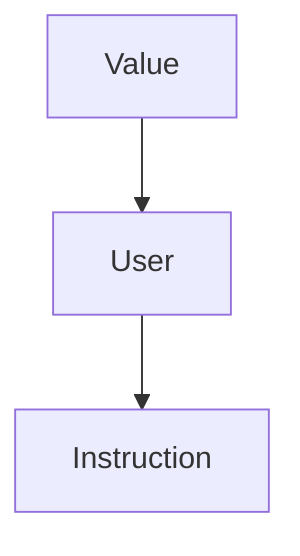

# ESERCITAZIONE 2

## Prerequisiti

· Ricorda il seguente schema di classi:



### Value

Ha dei metodi fondamentali come `getType() , hasName() , getName(), ...`.  
Inoltre ogni nodo _User_ ha una lista di _Value_ che lo compongono. Dato un _Instruction_ per ottenere tutti i suoi operandi fare:

```c++
User &Inst = ...;
for (auto Iter = Inst.op_begin(); Iter != Inst.op_end(); ++Iter)
    { Value *Operand = *Iter; }
```

### User

Da _User_,oltre agli operandi (Value), è possibile ottenere chi utilizza quella determinata instruzione.

```c++
User &Inst = ...;
for (auto Iter = Inst.user_begin(); Iter != Inst.user_end(); ++Iter)
    { User *InstUser = *Iter; }
```


## ESERCIZIO 1

### Parte1


1.Scarica i file **LocalOpts.cpp** e **Foo.ll** e inseriscili in `/TEST`

2.Copia il file **LocalOpts.cpp** in `LLVM/SRC/llvm-project-llvmorg-17.0.6/llvm/lib/Transforms/Utils`

3.Inserisci nel file **CMakeLists.txt** questo : `LocalOpts.cpp`

4.Crea il file **LocalOpts.h** in `LLVM/SRC/llvm-project-llvmorg-17.0.6/llvm/include/llvm/Transforms/Utils` e inserisci

```c++
#ifndef LLVM_TRANSFORMS_LOCALOPTS_H
#define LLVM_TRANSFORMS_LOCALOPTS_H

#include "llvm/IR/PassManager.h"


namespace llvm {
    class LocalOpts : public PassInfoMixin<LocalOpts> {
        public:
        PreservedAnalyses run(Module &M, ModuleAnalysisManager &AM);
    };
} // namespace llvm


#endif // LLVM_TRANSFORMS_TESTPASS _H
```


5.Edita il **PassRegistry.def** e **PassBuilder.cpp** presenti in `LLVM/SRC/llvm-project-llvmorg-17.0.6/llvm/lib/Passes`

1. Aggiungi `#include "llvm/Transforms/Utils/LocalOpts.h"` a **PassBuilder.cpp**
2. Aggiungi `MODULE_PASS("localopts", LocalOpts())` a **PassRegistry.def**

6.Vai in `/LLVM/BUILD/` Ricompila e installa opt:

1. `make opt`
2. `install opt`

7.Vai in `/LLVM`

8.Mandare il comando source `setup.sh` ( Eseguire questo step se si è settato il file setup.sh correttamente )

9.Mandare il comando : `INSTALL/bin/opt -p localopts TEST/Foo.ll -o Foo-optimized.bc`

10.Mandare il comando : `INSTALL/bin/llvm-dis Foo-optimized.bc -o Foo.optimized.ll`


#### Conclusione

Ora è possibile analizzare il file **LocalOpts.cpp** per capire cosa fa. Inoltre si può visionare il file
**Foo.optimized.ll** per vedere il codice IR che è stato generato dopo la compilazione.


## ESERCIZIO 2

```text
Per esercitarci a manipolare la IR modifichiamo adesso il
passo LocalOpts.cpp perché sostituisca tutte le operazioni di
moltiplicazione che hanno tra gli operandi una costante che
è una potenza di 2 con una shift (strength reduction)
Utilizzare solo funzioni di LLVM, non usare moduli matematici ( ex: #cmath )
Documentation on : < https://llvm.org/doxygen/classes.html >
```


ADVICE :  Ricordati che per compilare devi andare in `/LLVM/BUILD/`:

1. `make opt`
2. `install opt`
3. `cd ..`  
4. `INSTALL/bin/opt -p localopts TEST/Foo.ll -o Foo-optimized.bc`  
(esegui i passi di ottimizazione [nei passi fa parte LocalOpts.cpp] )

1.Modificare il file **LocalOpts.cpp**

```c++
#include "llvm/Transforms/Utils/LocalOpts.h"
#include "llvm/IR/Instructions.h"
#include "llvm/IR/InstrTypes.h"
// L'include seguente va in LocalOpts.h
#include <llvm/IR/Constants.h>

using namespace llvm;

bool runOnBasicBlock(BasicBlock &B) {
    
    unsigned cont = 0;
    //Itera tutte le istruzioni
    for (auto iter_i = B.begin() ; iter_i != B.end() ; ++iter_i){
        cont++;
        Instruction &I = *iter_i;
        
        if (I.isBinaryOp() && I.getOpcode() == Instruction::Mul) {
            BinaryOperator *mul = dyn_cast<BinaryOperator>(&I);
            outs()<<"("<<*mul<<")" <<" è una moltiplicazione\n";
            
            Value *op_0 = mul->getOperand(0);
            Value *op_1 = mul->getOperand(1);

            outs()<<"Operando[0] : "<<*op_0<<"\n";
            outs()<<"Operando[1] : "<<*op_1<<"\n";

            ConstantInt *C;
            Value *moltiplicando;
            if (C = dyn_cast<ConstantInt>(op_1)) {
                outs()<<"Operando[1] è una costante intera ("<<C->getValue()<<")\n";
                moltiplicando = op_0;
            }else if(C = dyn_cast<ConstantInt>(op_0)){
                outs()<<"Operando[0] è una costante intera ("<<C->getValue()<<")\n";
                moltiplicando = op_1;
            }
            
            //Controllo se ho trovato una costante
            if (C && C->getValue().isPowerOf2()){
                const llvm::APInt costanteIntera = C->getValue();
                outs()<<"Costante trovata, con potenza di 2 trovata!\n\n";
                // Conversione da mul -> shi
                Constant *shiftConst = ConstantInt::get(C->getType() , C->getValue().exactLogBase2());
                outs()<<"Provo a creare una nuova istruzione con v1 = "<<*moltiplicando<<" e v2 = "<<C->getValue()<<"\n";
                Instruction *new_shift = BinaryOperator::Create(BinaryOperator::Shl , moltiplicando , shiftConst); 
                //Inserimento istruzione dopo moltiplicazione
                new_shift ->insertAfter(mul);
            }

        }
    }
    outs() << "\nIstruzioni analizzate : "<<cont<<"\n";
    return true;
}

bool runOnFunction(Function &F) {
    bool Transformed = false;

    for (auto Iter = F.begin(); Iter != F.end(); ++Iter) {
        if (runOnBasicBlock(*Iter)) {
            Transformed = true;
        }
    }

    return Transformed;
}


PreservedAnalyses LocalOpts::run(Module &M,
                                      ModuleAnalysisManager &AM) {
    for (auto Fiter = M.begin(); Fiter != M.end(); ++Fiter)
        if (runOnFunction(*Fiter))
            return PreservedAnalyses::none();
    return PreservedAnalyses::all();
}

```

2.Soluzione consigli:

-> Per il logaritmo `exactLogBase2()`
-> Costruttore


## Primo assignment

```text
1. Algebraic Identity -> ...
2. Strength Reduction -> la cosa avanzata è che magari se la potenza è uguale a 15. Si può fare shift + add
3. Multi-Instruction Optimization -> ...
```
