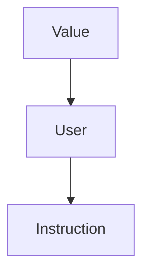

# ESERCITAZIONE 3

## Prerequisiti

· Ricorda il seguente schema di classi:



· Ricorda il seguente concetto (UD-DU):

... Insert img!!!

· Ricordati che:

- *Foo-optimized.bc* è il file binario generato
- *Foo.ll* è il file(IR) che stiamo ottimizando

· Ricordati che per compilare:

- `make opt (/BUILD)`
- `make -j16 install (/BUILD)`
- `INSTALL/bin/opt -p localopts TEST/Foo.ll -o Foo-optimized.bc`


## Consegna

Per ogni istruzione stampare:

1. I suoi usi nel codice      (UD_CHAIN)
2. Per ogni operando dell'istruzione, stampare la definizione dell'operando nel caso sia un altra istruzione.  (DU_CHAIN)


## Steps

1.Copia il file **LocalOpts.cpp** in `LLVM/SRC/llvm-project-llvmorg-17.0.6/llvm/lib/Transforms/Utils`

2.Modificarlo nel seguente modo:


```c++
#include "llvm/Transforms/Utils/LocalOpts.h"
#include "llvm/IR/Instructions.h"
#include "llvm/IR/InstrTypes.h"
// L'include seguente va in LocalOpts.h
#include <llvm/IR/Constants.h>

using namespace llvm;

bool runOnBasicBlock(BasicBlock &B) {
    

    int cont = 0;
    for (auto &I : B) {

        outs()<<"---------------------------------------------\n";
        outs()<<"Analisi istruzione - "<<cont++<<"\n";
        outs()<<"Istruzione : "<<I<<"\n";
        outs()<<"Istruzione come operando : ";
        I.printAsOperand(outs(), false);
        outs()<<"\n";

        
        outs()<<"Lista operandi : \n";
        for (auto *Iter = I.op_begin(); Iter != I.op_end(); ++Iter) {
            Value *Operand = *Iter;
            if (Argument *Arg = dyn_cast<Argument>(Operand)) {
                outs() << "\t" << *Arg << ": SONO L'ARGOMENTO N. " << Arg->getArgNo() <<" DELLA FUNZIONE " << Arg->getParent()->getName()<< "\n";
            }
            else if (ConstantInt *C = dyn_cast<ConstantInt>(Operand)) {
                outs() << "\t" << *C << ": SONO UNA COSTANTE INTERA DI VALORE " << C->getValue()<< "\n";
            }else {
                Instruction* I_temp = dyn_cast<Instruction>(Operand);
                outs()<<"\t"<<"SONO UN ALTRA ISTRUZIONE CHE È DEFINITA IN QUESTO MODO : "<<*I_temp<<"\n";    // DU CHAIN
            }
        }

        outs() << "Lista degli usi:\n";      // UD CHAIN
        for (auto Iter = I.user_begin(); Iter != I.user_end(); ++Iter) {
            outs() << "\t" << *(dyn_cast<Instruction>(*Iter)) << "\n";
        }

        outs()<<"---------------------------------------------\n\n\n";
    }


    return true;
  }


bool runOnFunction(Function &F) {
  bool Transformed = false;

  for (auto Iter = F.begin(); Iter != F.end(); ++Iter) {
    if (runOnBasicBlock(*Iter)) {
      Transformed = true;
    }
  }

  return Transformed;
}


PreservedAnalyses LocalOpts::run(Module &M,
                                      ModuleAnalysisManager &AM) {
  for (auto Fiter = M.begin(); Fiter != M.end(); ++Fiter)
    if (runOnFunction(*Fiter))
      return PreservedAnalyses::none();
  
  return PreservedAnalyses::all();
}
```


