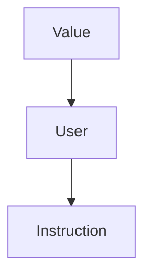

# ESERCITAZIONE 4

-> Slide-08 Esercitazione - Loops e UD-DU Chains

## Prerequisiti

· Ricorda il seguente schema di classi:



· Ricordati che:

- *Foo-optimized.bc* è il file binario generato
- *Foo.ll* è il file(IR) che stiamo ottimizando

· Ricordati che per compilare:

- `make opt (/BUILD)`
- `make -j16 install (/BUILD)`
- `INSTALL/bin/opt -p localopts TEST/Foo.ll -o Foo-optimized.bc`


## Consegna

### 1.Verificare che il loop sia in forma normale

`isLoopSimplifyForm()`

### 2.Recuperare blocchi significativi del loop

```c++
getLoopPreheader () const`
getHeader() const
getBlocks() const
```

### 3.Scorrere i basic blocks che compongono un loop

```c++

for (Loop::block_iterator BI = L->block_begin(); BI != L->block_end(); ++BI);

```


## Steps

1.vai nella directory `/LLVM/SRC/llvm-project-llvmorg-17.0.6/llvm/include/llvm/Transforms/Utils/`

2.Aggiungi il file **LoopPass.h**

```c++
#ifndef LLVM_TRANSFORMS_LOOPPASS_H
#define LLVM_TRANSFORMS_LOOPPASS_H

#include "llvm/IR/PassManager.h"


namespace llvm {
    class LoopPass : public PassInfoMixin<LoopPass> {
        public:
        PreservedAnalyses run(Loop &L, LoopAnalysisManager &LAM , LoopStandardAnalysisResults &LAR, LPMUpdater &LU);
    };
} // namespace llvm


#endif // LLVM_TRANSFORMS_TESTPASS _H
```

3.vai nella directory `/LLVM/SRC/llvm-project-llvmorg-17.0.6/llvm/lib/llvm/Transforms/Utils/`

4.Aggiungi il file **LoopPass.cpp**

```c++
#include "llvm/Transforms/Utils/LoopPass.h"
#include "llvm/IR/Instructions.h"
#include "llvm/IR/InstrTypes.h"
#include <llvm/IR/Constants.h>

using namespace llvm;

PreservedAnalyses LoopPass::run(Loop &L, LoopAnalysisManager &LAM , LoopStandardAnalysisResults &LAR, LPMUpdater &LU);) {
  
  outs()<<"hi\n";
  
  return PreservedAnalyses::all();
}

```

5.vai nella directory  ` /LLVM/SRC/llvm-project-llvmorg-17.0.6/llvm/lib/llvm/Transforms/Utils/ `

6.Modifichi il file CMakeList.txt e aggiungi il nome "LoopPass.cpp" mettilo in ordine alfabetico.

7.vai nella directory  `/LLVM/SRC/llvm-project-llvmorg-17.0.6/llvm/lib/Passes/PassRegistry.def`

8.Aggiungi questa riga `LOOP_PASS("loop_pass", LoopPass())` al file **PassRegistry.def**

9.Aggiungi questa riga `#include "llvm/Transforms/Utils/TestPass.h` al file **PassBuilder.cpp**

10.Vai in `/LLVM/BUILD/` e manda il comando `make opt` e successivamente `make install`

11.Andare in `/LLVM` e mandare il comando source `setup.sh`

12.Andare nella directory `LLVM/` e poi mandare il comando
`opt -passes=testpass TEST/Loop.bc \ -disable-output`

`INSTALL/bin/opt -passes=testpass TEST/Loop.ll -disable-output`


