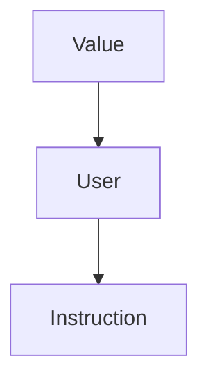

# ESERCITAZIONE 5

## Prerequisiti

· Ricorda il seguente schema di classi:



· Ricordati che:

- *Foo-optimized.bc* è il file binario generato
- *Loop.ll* è il file(IR) che stiamo ottimizando

· Ricordati che per compilare:

- `make opt (/BUILD)`
- `make -j16 install (/BUILD)`
- `INSTALL/bin/opt -p localopts TEST/Foo.ll -o Foo-optimized.bc`


## Consegna

• A partire dal codice della precedente esercitazione implementare un passo di Loop-Invariant Code Motion (LICM).


## Steps

1. Seguire lo step di inizializzazione in <b>Esercitazione5</b>

2. Cambiare il codice di <b> LoopPasses.cpp </b>

```c++
```

3. Cambiare il codice di <b> LoopPasses.h </b>

```c++
```


