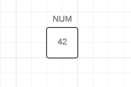
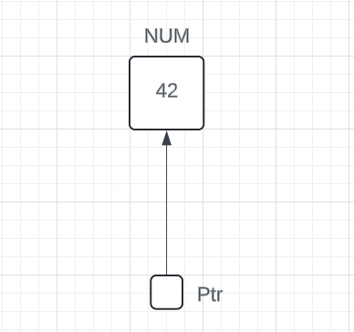
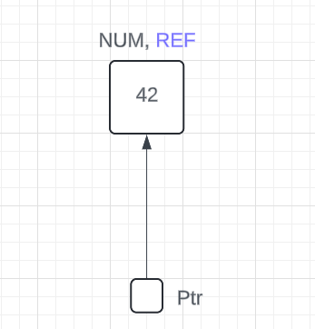

# Pointer and Reference

## Example1

``` c++
#include <iostream>

int main() {
    int num = 42;      // Step1
    int* ptr = &num;   // Step2
    int& ref = *ptr;   // Step3

    std::cout << "Valore di num: " << num << std::endl;      // Step1
    std::cout << "Valore di *ptr: " << *ptr << std::endl;    // Step2
    std::cout << "Valore di ref: " << ref << std::endl;      // Step3

    *ptr = 10;  // Modifica il valore di num utilizzando il puntatore
    std::cout << "Nuovo valore di num: " << num << std::endl;

    ref = 20;  // Modifica il valore di num utilizzando la reference
    std::cout << "Nuovo valore di num: " << num << std::endl;

    return 0;
}
```

*Grafic explanation- Step1:*  
</img>


*Grafic explanation- Step2:*  
</img>

*Grafic explanation- Step3:*  
</img>

