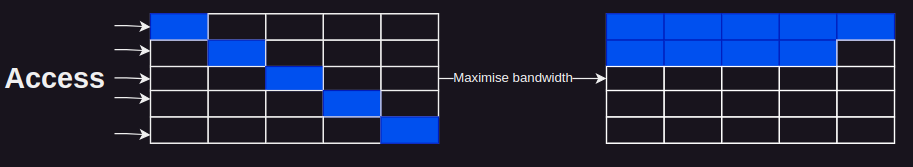

# Appunti su slide-new

## Cache Misses

1. <b>Compulsory</b> -> Quando la cache è fredda, non ci sono dati nella cache.
2. <b>Conflict</b> -> Quando 2 indirizzi sono mappati alla stessa linea della cache.
3. <b>Capacity</b> -> Quando non ho più spazio nella cache per ospitare altre richieste.

## Types of Caches

1. <b>Direct Mapped Cache</b> -> Tanti indirizzi condividono la stessa linea.
2. <b>Fully Associatived Cache</b> -> Ogni indirizzo ha una linea. Aumenta la complessità di comparazione.
3. <b>Set associatived Cache</b> -> Mix of 1 e 2.

</img>

## Memory Hierarchy Optimizations

1. Reduce memory latency (Poche miss)
2. Maxime memory bandwidth (Cercare di accedere a tutti i dati, burst mode)

</img>

