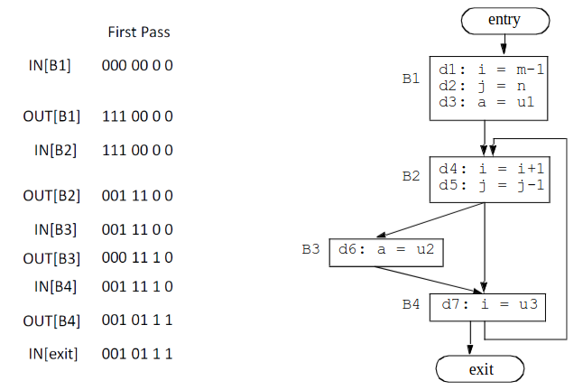
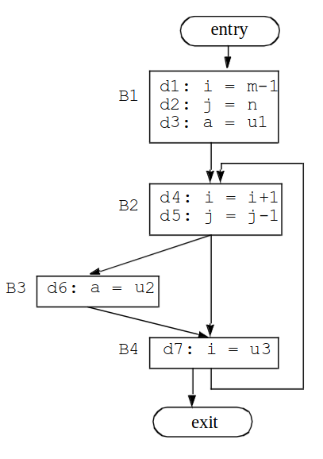
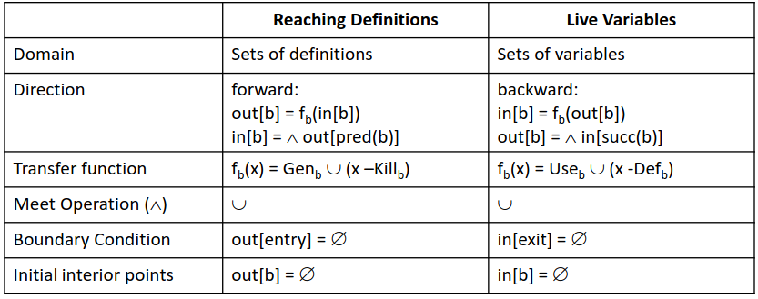
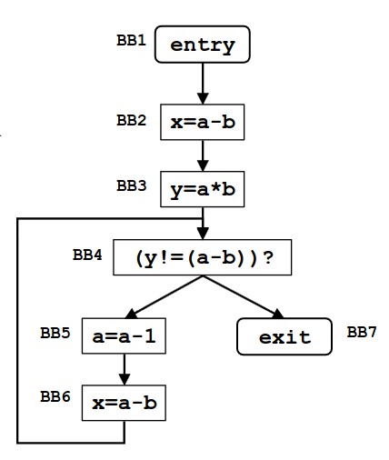

# Appunti su slide-07

## Difference about local/global/interprocedural analisys

- Local -> part of a CFG.
- Global -> the *entire* CFG.
- Interprocedural -> more than 1 module.

## Data Flow analisys

Steps fondamentali:

1. Definire un dominio: Se ci interessano variabili,definizioni o espressioni.
2. Direzione dell'analisi: Bisogna capire se l'informazione è nel passato o futuro.
3. Capire cos'è il concetto di *Generation* e *Kill*
4. Capire qual'è il *meet operator* -> Unione,Intersezione...?
5. Capire inizializzazione.

- Definition
- Start from CFG (Control Flow Graph)
- For each point of the programm(prima e dopo ogni statements) you make an analisys.

BasickBlock effects:

1. *Uses* -> b,c                      \[USE\]
2. *Kills* a definition -> a          \[KILL\]
3. *Defines* a variable -> a          \[DEF\]

Locally exposed use -> non è preceduto nel BB da una definizione della stessa variabile.  
Locally available definition -> ? 

*Locally exposed use, Example:*

```c++

t1 = r1+r2   // Usi localmente esposti -> r1,r2
r2 = t1      // Definizioni uccise -> r2
t2 = r2+r1    
r1 = t2
t3 = r1*r1
r2 = t3
if r2>100 goto L1

```

## 1. Reaching Definitions

- Per ogni punto del programma se esiste un percorso da p a d tale per cui d non è uccisa.
- Creo un bit vettor: bool v[n_definitions]
- Watch examples: pag 20,21,22,23,24.


### Reaching definitions - algorithm

```c++

// Initialize
out[Entry] =  // can set out[Entry] to special def
// if reaching then undefined use
For all nodes i
    out[i] =  // can optimize by out[i]=gen[i]

ChangedNodes = N
// iterate
    While ChangedNodes ≠  {
        Remove i from ChangedNodes
    in[i] = U (out[p]), for all predecessors p of i
    oldout = out[i]
    out[i] = fi(in[i]) // out[i]=gen[i]U(in[i]-kill[i])
    if (oldout ≠ out[i]) {
        for all successors s of i
            add s to ChangedNodes
    }
}

```

### Reaching definitions - transfer function

F : `<Insert from slide...>`


### Example slide_48

</img>

1. Crea tabella gen e kill

|    | Gen   | Kill |
|----|-------|------|
| B1 | 1,2,3 | 4,5,6,7|
| B2 | 4,5   | 1,2,7  |
| B3 | 6     | 3      |
| B4 | 7     | 1,4    |


2. 

```text

*Iteration-1

--------------------B1------------------                                                  It-0                 
OLDOUT[B1] = ∅ 
OUT[B1] = Gen[B1] U (In[B1] - Kill[B1]) = 1,2,3 U ∅ = 1,2,3   => OUT[B1] = 1,2,3    [CHANGED from old]
--------------------B1------------------

--------------------B2------------------
In[B2] = OUT[B1] U OUT[B4] = 1,2,3 U  ∅ = 1,2,3  => IN[B2] = 1,2,3
OLDOUT[B2] = ∅
OUT[B2] = 4,5 U (1,2,3-1,2,7) = 3,4,5 => OUT[B2] = 3,4,5                            [CHANGED from old]
--------------------B2------------------

--------------------B3------------------
In[B3]=OUT[B2] = 3,4,5
OLDOUT[B3] = ∅
OUT[B3] = 6 U (3,4,5-3) = 4,5,6 => OUT[B3] = 4,5,6                                  [CHANGED from old]
--------------------B3------------------

--------------------B4------------------
In[B4] = OUT[B2] U OUT[B3] = 3,4,5,6Ù
OLDOUT[B4] = ∅
OUT[B4] = 7 U (3,4,5,6-1,4) = 3,5,6,7 =>  OUT[B4] = 3,5,6,7                         [CHANGED from old]
--------------------B4------------------

*Iteration-2
...
*Iteration-3
...

(Continua fino a quando per ogni BB (OLDOUT == OUT) )

```

## 2. Liveness Analysis (slide>52...)

- Determinare per ogni linea di del basic block, se una variabile è viva.  
- Il bit vector sarà un bit per ogni variabile bool v[n_variable]


### Liveness analysis - algorithm


```c++

input: control flow graph CFG = (N, E, Entry, Exit)

// Boundary condition
in[Exit] = 

// Initialization for iterative algorithm
For each basic block B other than Exit
in[B] = 

// iterate
While (Changes to any in[] occur) {
    For each basic block B other than Exit {
        out[B] =  (in[s]), for all successors s of B
        in[B] = fB(out[B]) // in[B]=Use[B]
        (out[B]-Def[B])
    }
}

```

### Liveness analysis - transfer function + input unione

F : `in[B] = Use[B] U (out[B] - Def[B] )`
I_Union :  `out[B] = in[next-0] U in[next-1] U ... U ... in[next-n]  //Significa l'unione di tutti gli input del blocco successivo`

### Example slide 59

</img>


```text

*Iteration-1

--------------------B4------------------                                                  It-1                 
OLD_IN[B4] = ∅ 
IN[B4] = u3
--------------------B4------------------ 

--------------------B3------------------ 
OLD_IN[B3] = ∅ 
IN[B3] = u2,u3
--------------------B3------------------ 

--------------------B2------------------ 
OLD_IN[B2] = ∅ 
IN[B2] = i,j,u2,u3
--------------------B2------------------ 

--------------------B1------------------ 
OLD_IN[B1] = ∅ 
IN[B1] = m,n,u1,u2,u3
--------------------B1------------------ 

*Iteration-2

--------------------B4------------------                                                  It-2                 
OUT[B4] = IN[exit] U IN[B2] = i,j,u2,u3
OLD_IN[B4] = u3
IN[B4] = u3 U (i,j,u2,u3) - i = j,u2,u3
--------------------B4------------------ 

...Continue...


*Iteration-3
...

(Continua fino a quando per ogni BB (OLDOUT == OUT) )

```


## Reaching Definitions VS Liveness Analysis

</img>


## 3. Available Expressions

### Definition

- Una espressione x ⊕ y è available in un punto p del
programma se ogni percorso che parte dal blocco ENTRY
e arriva a p valuta l’espressione x ⊕ y
- Un blocco genera l’espressione x ⊕ y se valuta x ⊕ y e
non ridefinisce in seguito x o y
- Un blocco uccide l’espressione x ⊕ y se assegna (o
potrebbe assegnare) un valore a x o y e non ricalcola
successivamente x ⊕ y.
- Ha una direzione forward come le "Reaching Definitions".

### Available expression - transfer function

Fb = `gen_b U (x-kill_b)`    // x = OUTb-1

Equazioni OUT: OUT[B] = F(IN[B]) 
Equazioni IN: IN[B] = ∩(OUT[B])
Condizioni contorno = OUT[ENTRY] = ∅ 
Condizioni iniziali = OUT[Bi] = u (universal set, cioè tutte le espressioni possibili).


### Example slide 94

</img>


1.Definizione dominio:

D = { a-b , a*b , a-1 }
Vector_bit[3];   // 3 = |D|ù

2.Creazione tabella:

Kill -> Un blocco killa uno statemt x o y se definisce x o y.
Gen -> VA nel gen set qualcosa che valuta l'esspressione ma non dove scrivere qualcuno dei suoi operandi.

|    | Gen   | Kill |
|----|-------|------|
| B2 |  a-b  |      |
| B3 |  a*b  |      |
| B4 |  a-b  |      |
| B5 |       | (a-b)  (a*b) (a-1) |
| B6 |  a-b  |      |


3.Iterazioni

```text

*Iteration-1

--------------------B2------------------
IN[B2] = OUT[Entry] = ∅
OLD_OUT[B2] = u
OUT[B2] = (a-b) U = a-b
--------------------B2------------------      

--------------------B3------------------
IN[B3] = OUT[B2] = a-b
OLD_OUT[B3] = u
OUT[B3] = (a*b) U (a-b) - ∅ = (a-b)(a*b)
--------------------B3------------------

--------------------B4------------------
IN[B4] = OUT[B3] ∩ OUT[B6] = (a-b)(a*b)
OLD_OUT[B4] = u
OUT[B4] = (a-b) U (a-b) = (a-b)(a*b)
--------------------B4------------------  

--------------------B5------------------
IN[B5] = OUT[B4] = (a-b)(a*b)
OLD_OUT[B5] = u
OUT[B5] = ∅ U (( (a-b) (a*b) ) - (a-1)(a-b)(a*b) = ∅)
--------------------B5------------------ 

--------------------B6------------------
IN[B6] = OUT[B5] = ∅
OLD_OUT[B6] = u
OUT[B6] = (a-b) U ∅ - ... = (a-b)
--------------------B6------------------ 

*Iteration-2

...

```