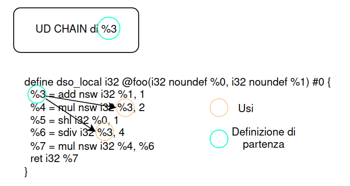
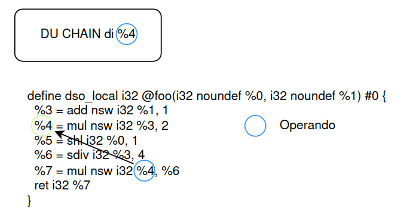

# Appunti su slide-08

## UD chain vs DU chain

*UD CHAIN: Use -> Definition*  
</img>

*DU CHAIN: Definition -> Uses*  
</img>  

## Loop

### Proprietà fondamentali

1. Singolo *Entry point*.
2. Gi archi devono formare almeno un ciclo. *Back-edge* -> è un arco in cui la testa domina ...

### Dominator

Un nodo d domina un nodo n in un grafo(d <b>dom</b>n) se ogni percorso dall'ENTRY node a n passa per d.

### Dominator tree

Una rappresentazione dove rendo esplicita la relazione di dominanza.

#### Exercise - Try to build the dominator tree from the following CFG

...Insert img...

Tree-1:
1
    2
    3
        4
            5
            6
            7
                8

...Insert img2...

Tree-2:

### Identificare i Loop Naturali

#### 1. Trovare le relazioni di dominanza nel flow graph. Trovare i dominatori

- Def: Un nodo d domina un node n in un grafo(d dom n) se ogni percorso dell'entry node a n passa per d.
- Direzione: forward
- Dominio: BasicBlocks
- Meet operator: Intersezione
- Condizioni al contorno: Out[Entry] = {Entry}
- Condizioni iniziali: Out[B] = Universal set
- Funzione di trasferimento: `GEN[B] U In[B]`

...insert img...

Out[b1] = ...
...
Out[b3] = gen[b3] U in[b3] = 3 U out[b1] ∩ out[b2] = 1,3.
Out[b4] = gen[b4] U in[b4] = 4 U out[b3] ∩ out[b7] = 1,3,4.
Out[b5] = gen[b5] U in[b5] = 5 U out[b4] = ...
Out[b6] = 1,3,4,6
Out[b7] = 1,3,4,7
...
Out[b10]

#### 2. Identificare i *back edges*

...insert img... DFST

1. Use of depth-first visit.
2. Creation of DFST
3. Categorizzazione degli archi
    1. Advancing.
    2. Retreating.
    3. Cross.

#### 3. Trovare il loop naturale associato al *back edge*

Watch algoritm...

