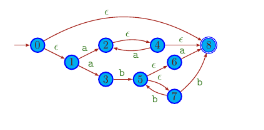
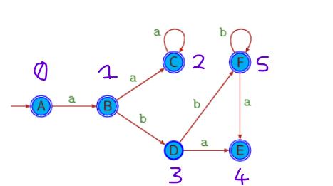
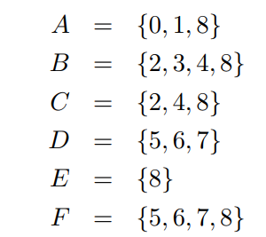

# Homework 1

Lo scopo principale del homework è quello di implementare <b>Subset Construction</b> Algoritm.<br>
Il progetto è diviso in 2 parti.
 - Part1: Subset Construction.
 - Part2: Creazione di un automa a partire da un albero.
  
<br>

## How to run the programm

#### Option 1

```bash
g++ postorder.cpp` 
./a.out tree1.txt > input.txt`    # ( Di default l'output è fatto su IOSTREAM )
g++ substet_construction.cpp` 
./a.out input.txt`
```


#### Option2

```bash
g++ -o post.exe postorder.cpp`
g++ -o subset.exe subset_construction.cpp`
./post.exe tree1.txt | ./subset.exe`
```

<br><br>

## Part1 (Subset Construction)

Source file name : `subset_construction.cpp` <br>
Input : Automa finito non deterministico. <br>
Output: Automa finito deterministico <br>
S → Simboli alfabeto  ( messi in un SET di caratteri ) <br> 
K → Numero stati ( va dedotto dal numero di righe ) <br>
□ se in una generica riga c’è scritto → p q r  ( questi sono gli stati che può andare dallo stato i,j ) <br>

---

### Input

Input - Graphic

<br>

Input - Text

```c++
a b                             //Simboli dell’alfabeto (ε,a,b) 
8 #                             //Stati finali
1 8                             // Δ (0,"ε")        
<riga vuota>                    // Δ (0,”a”)  
<riga vuota>                    // Δ (0,”b”) 
<riga vuota>                    // Δ (1,ε)
2 3                             // Δ(1,”a”) → cioè dallo stato 1 con input = “a”
<riga vuota>                    // Δ(1,”b") → cioè dallo stato 1 con input = “b”
4                               // Δ(2,”ε")...
<4 righe vuote>                 // ...
5 
8 
2 
<riga vuota>
6 7 
<3 righe vuote>
8 
<3 righe vuote>
5 8 
<3 righe vuote>
<eof>
```
<br>

### Output

Output - Graphic

<table>
    <tr>
        <td><br></td>
        <td><br></td>
    </tr>

</table>
Output - Text

```c++
// State set
0 1 8                 // A = {0,1,8}
2 3 4 8               // B = {2,3,4,8}
2 4 8                 // C = {2,4,8}
5 6 7                 // D = {5,6,7}
8                     // E = {8}
5 6 7 8               // F = {5,6,7,8}
0 1 2 4 5             // G = {0,1,2,4,5}

// Transiction functions
1 # ẟ(0,a) = 1
<riga vuota>          // (0,”b”)
2 # ẟ(1,a) = 2
3 # ẟ(1,b) = 3
2 # ẟ(2,a) = 2
<riga vuota>           //  (0,”b”)
4 # ẟ(3,a) = 4
5 # ẟ(3,b) = 5
4 # ẟ(4,a) = 4
5 # ẟ(4,b) = 5
```

### Explanation

## Part2 (automaton construction)

Source file name : `postorder.cpp` <br>
Input : File di testo contente la rappresentazione lineare di un albero <br>
Output : Automa a stati finiti non deterministico. <br>

### Input

Input - Text

```text
a b c
  ( .(b)(| (.(a) (b))(. (*(a))(c)) ))
```
<br>

### Output

Output - Text

```c++

a b c   //Simboli dell’alfabeto (ε,a,b,c) 
14      //Stati finali
        // Δ (0,"ε")      
        // Δ (0,"a")
1       // Δ (0,"b")
        // Δ (0,"c")
12      // Δ (1,"ε")
        // Δ (1,"a")
        // ...
        // ...
        // ...
3       
<2 righe vuote>
4
<5 righe vuote>
5
<riga vuota>
13
<4 righe vuote>
7
<2 righe vuote>
9 6
<3 righe vuote>
6 9
<3 righe vuote>
10
<6 righe vuote>
11
13
<3 righe vuote>
2 8
<7 righe vuote>
```


