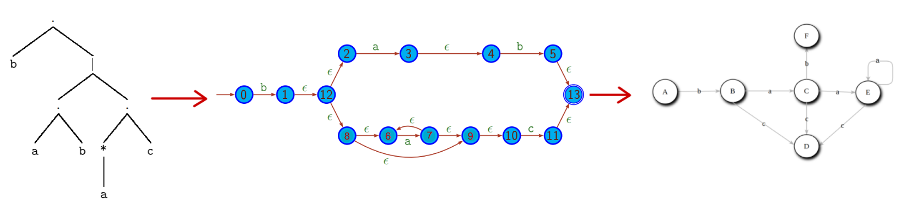

# Laboratorio

## Homework 1 📁

This directory contains the implementation of <b>Subset Construction</b>.  
This algorithm allows to transform a _non deterministic automaton into a _deterministic one_.  
There is also a function that create a _non deterministic automaton_ from an _AST(Abstract Syntax Tree)_

<b> Abstrac Syntax Tree ⮕ Non determinstic automaton ⮕ Deterministic automaton </b>

  

## lexer_cpp(nativo) 📁

Implementation of a lexer using cpp.

  

## lexer_cpp(flex) 📁

Implementation of a lexer using `Flex` (open source tool).