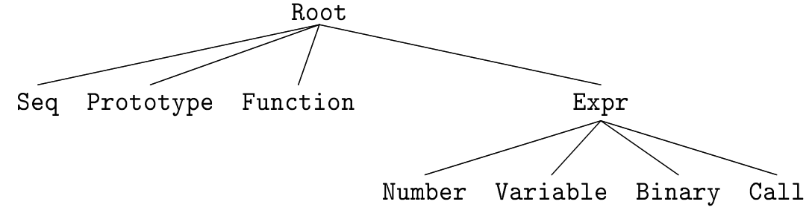
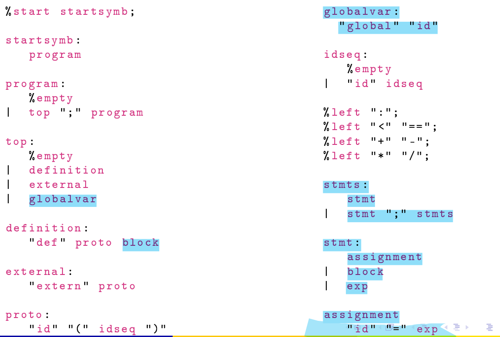
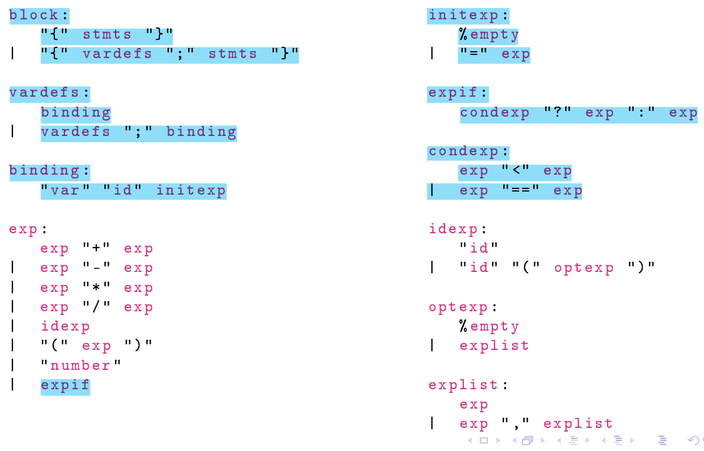
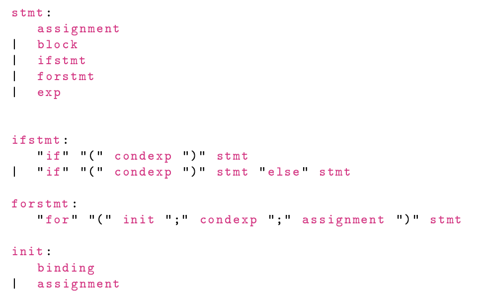

# My first Front-End compiler.

⚠ Remember to install dependencies package!

## How to start the compiler

1. `make`
2. `./kcomp <filename>` -> Stampa in stderr il codice IR generato.
    - Example : `./kcomp input.txt 2> output.ll`
  
## How to test the compiler

⚠ Remember to create ./kcomp exe file.
1. `cd tester_progetto/`
2. `make <nome pgm>`
   - Example : `make floor`
3. `./floor`

## How to try if the generated IR code does what you expected

### .ll version
1. Save in a file with .ll extension the IR code    
2. `lli <file_name>.ll`               

### .s version
1. Save in a file with .s extension the IR code    
2. `clang -o file_exe input.s`


## Theoretical Prerequisites

<b>Abstract Syntax Tree scheme</b>:

</img>

---

<b>NamedValues (driver.cpp)</b>:

It is a map of Driver class.
```text

Map = { <str,AllocaInst*> , <str,AllocaInst*> , ... }

// Each <str> rappresent the name of a variable.

```
usage:

```c++
AllocaInst *A = drv.NamedValues[Name];
if (!A)
    return LogErrorV("Variabile non definita");
return builder->CreateLoad(A->getAllocatedType(), A, Name.c_str());
```


<br><br>
## Steps

### Grammar Level 1.0

New features from the starting grammar are <span style="color:#57DDFF">highlighted</span>.

<table>
    <tr>
        <td> </img> </td>
        <td> </img> </td>
    </tr>
</table>

Feature:

1. Block.
2. Statements.
3. Vardefs.
4. Assignments
5. Init of local variable.
6. Init of global variable.
7. Condition(IF).
    
<br>

#### Block and Statements (step1_1)

These are the first feature we are going to implement.
Because we need a base for Bindings,Assignments,If.
<br><br>
Summary of each steps:

1. Add <b>class</b>, <b>type</b>, <b>token</b> and <b>rules</b> on grammar(</b>parser.yy<b>)

    ```c++

    ///////////////////////////////////CLASS//////////////////////////////////////////
    %code requires {
    ...
    class BlockAST;    //New
    }

    ///////////////////////////////////TOKEN//////////////////////////////////////////

    %define api.token.prefix {TOK_}
    %token
    LPAREN_G   "{"  //New
    RPAREN_G   "}"  //New
    ;

    ///////////////////////////////////TYPE//////////////////////////////////////////

    %type <BlockAST*> block;
    %type <std::vector<ExprAST*>> stmts;
    %type <ExprAST*> stmt;

    ///////////////////////////////////RULES//////////////////////////////////////////

    definition:
    "def" proto block   { $$ = new FunctionAST($2,$3); $2->noemit(); };  // <----- change exp with block

    stmts:
    stmt                 { std::vector<ExprAST*> statemets; statemets.insert(statemets.begin(),$1); $$ = statemets;}
    | stmt ";" stmts       { $3.insert($3.begin(),$1); $$ = $3; };

    stmt:
    block                    { $$ = $1;}
    | exp                    { $$ = $1;};

    block:
    "{" stmts "}"                     { $$ = new BlockAST($2); };

    ```

2. Add class header(<b>driver.hpp</b>)

    ```c++
    /// BlockAST
    class BlockAST : public ExprAST {
    private:
        std::vector<BindingAST*> bindings;
        std::vector<ExprAST*> stmts;
    public:
    BlockAST(std::vector<BindingAST*> bindings,std::vector<ExprAST*> stmts);
    BlockAST(std::vector<ExprAST*> stmts);
    Value *codegen(driver& drv) override;
    };
    ```

3. Add class implementation(<b>driver.cpp</b>)

    ```c++

    /*************************Block******************************/
    BlockAST::BlockAST(std::vector<BindingAST*> bindings,std::vector<ExprAST*> stmts):
    bindings(std::move(bindings)), stmts(std::move(stmts)) {};

    BlockAST::BlockAST(std::vector<ExprAST*> stmts):
    stmts(std::move(stmts)) {};

    Value* BlockAST::codegen(driver& drv){

    Value* blockValue;
    
    // Statements allocator
    for(int i=0; i<stmts.size(); i++){
        blockValue = stmts[i]->codegen(drv);
        if(!blockValue) return nullptr;
    }
    
    return blockValue;   
    };
        
    ```

4. Add token on <b>scanner.ll</b>

    ```c++
    "{"      return yy::parser::make_LPAREN_G  (loc);
    "}"      return yy::parser::make_RPAREN_G  (loc);
    ```


#### Vardefs,Assignments and Binding (step1_2)

1. Add <b>class</b>, <b>type</b>, <b>token</b> and <b>rules</b> on grammar(</b>parser.yy<b>)

    ```c++

    ///////////////////////////////////CLASS//////////////////////////////////////////
    %code requires {
    ...
    class BindingAST;    //new
    class AssignmentAST; //new
    }

    ///////////////////////////////////TOKEN//////////////////////////////////////////

    %define api.token.prefix {TOK_}
    %token
    EQUAL      "="
    ;

    ///////////////////////////////////TYPE//////////////////////////////////////////

    %type <ExprAST*> initexp
    %type <AssignmentAST*> assignment;
    %type <std::vector<BindingAST*>> vardefs;
    %type <BindingAST*> binding;

    ///////////////////////////////////RULES//////////////////////////////////////////

    stmts:
    stmt                 { std::vector<ExprAST*> statemets; statemets.insert(statemets.begin(),$1); $$ = statemets;}
    | stmt ";" stmts       { $3.insert($3.begin(),$1); $$ = $3; };

    stmt:
    assignment                 { $$ = $1;}
    | block                    { $$ = $1;}
    | exp                      { $$ = $1;};

    assignment:
    "id" "=" exp           { $$ = new AssignmentAST($1,$3);};

    block:
    "{" stmts "}"                  { $$ = new BlockAST($2); };
    | "{" vardefs ";" stmts "}"      { $$ = new BlockAST($2,$4); };

    vardefs:
    binding                { std::vector<BindingAST*> bindings; bindings.insert(bindings.begin(),$1); $$ = bindings;}
    | vardefs ";" binding    { $1.insert($1.begin(),$3); $$ = $1; };

    binding:
    "var" "id" initexp   { $$ = new BindingAST($2,$3); };

    ```

2. Add class header(<b>driver.hpp</b>)

    ```c++
    // Binding - Classe che rappresenta un binding (Ex: var x = 7)
    class BindingAST : public RootAST{
        private:
            std::string name;
            ExprAST* val;
        public:
            BindingAST(std::string name , ExprAST *val);
            AllocaInst* codegen(driver& drv);
            std::string& getName();
            ExprAST* getValue();
    };

    // Assignment - Classe che rappresenta un assignment (Ex: x = 13)
    class AssignmentAST : public ExprAST{
        private:
            std::string name;
            ExprAST* val;
        public:
            AssignmentAST(std::string name , ExprAST *val);
            Value* codegen(driver& drv);
            std::string& getName();
            ExprAST* getValue();
    };
    ```

3. Add class implementation(<b>driver.cpp</b>)

    ```c++

    /************************* Binding **************************/
    BindingAST::BindingAST(std::string name, ExprAST* val) : name(name), val(val) {};

    //Getter
    std::string& BindingAST::getName(){ return name; };
    ExprAST* BindingAST::getValue(){ return val; };

    //Methods
    AllocaInst* BindingAST::codegen(driver& drv) {
    Function *fun = builder->GetInsertBlock()->getParent();
    Value* boundval;
    if (val){
        boundval = val->codegen(drv);
    }
    else{
        NumberExprAST* defaultVal = new NumberExprAST(0.0);
        boundval = defaultVal->codegen(drv);
    }
    AllocaInst* Alloca = CreateEntryBlockAlloca(fun,name);
    builder->CreateStore(boundval,Alloca);
    return Alloca;
    };

    /************************* Assignment **************************/

    AssignmentAST::AssignmentAST(std::string name , ExprAST* val) : name(name) , val(val) {};

    //Getter
    std::string& AssignmentAST::getName(){ return name; };
    ExprAST* AssignmentAST::getValue(){ return val; };

    //Methods
    Value* AssignmentAST::codegen(driver& drv) {
        AllocaInst *Alloca = drv.NamedValues[name];
        Value* boundval = val->codegen(drv);
        if (!Alloca){
            GlobalVariable *globalVar = module->getNamedGlobal(name);  //Le variabili globali non sono presenti in drv.NamedValues[]
            if(!globalVar){
                std::cout<<"{AssignmentAST} Variabile non definita [name = "<<name<<" ]";
                return nullptr;
            }else{
                builder->CreateStore(boundval,globalVar);  //Inserimento di "boundval" nell'indirizzo di globalVar
                return boundval;
            }
        }
        builder->CreateStore(boundval,Alloca);  //Inserimento di "boundval" nell'indirizzo di alloca
        return boundval;
    };
    ```

4. Add token on <b>scanner.ll</b>

    ```c++
    "="      return yy::parser::make_EQUAL     (loc);
    ```


#### Global Variable (step1_3)

1. Add <b>class</b>, <b>type</b> and <b>rules</b> on grammar(</b>parser.yy<b>)

    ```c++

    ///////////////////////////////////CLASS//////////////////////////////////////////
    %code requires {
    ...
    class GlobalVariableAST; //new
    }

    ///////////////////////////////////TYPE//////////////////////////////////////////

    %type <GlobalVariableAST*> globalvar;

    ///////////////////////////////////RULES//////////////////////////////////////////

    top:
    %empty                  { $$ = nullptr; }   //old
    | definition            { $$ = $1; }        //old
    | external              { $$ = $1; }        //old
    | globalvar             { $$ = $1; };       //<----------- Aggiunto new

    globalvar:
        "global" "id"         { $$ = new GlobalVariableAST($2); };

    ```

2. Add class header(<b>driver.hpp</b>)

    ```c++
    /// GlobalVariableAST
    class GlobalVariableAST: public RootAST{
    private:
        std::string name;
    public:
        GlobalVariableAST(std::string name);
        Value* codegen(driver& drv) override;
        std::string& getName();
    };
    ```

3. Add class implementation(<b>driver.cpp</b>)

    ```c++

    /******************** Variable Expression Tree ********************/ // *Modified*
    //Modified- Variable Expression Tree 
    //Change the following code 
    Value *VariableExprAST::codegen(driver& drv) {
    AllocaInst *A = drv.NamedValues[Name];
        if (!A){
            GlobalVariable *globalVar = module->getNamedGlobal(Name);  //Le variabili globali non sono presenti in drv.NamedValues[]
            if(!globalVar)
                return LogErrorV("{VariableExprAST} Variabile non definita [name = " + Name + " ]");
            else
                return builder->CreateLoad(globalVar->getValueType(), globalVar, Name.c_str());
        }
        return builder->CreateLoad(A->getAllocatedType(), A, Name.c_str());
    }  

    /************************* Assignment **************************/   // *Modified*
    AllocaInst* AssignmentAST::codegen(driver& drv) {
        AllocaInst *Alloca = drv.NamedValues[name];
        Value* boundval = val->codegen(drv);
        if (!Alloca){
            GlobalVariable *globalVar = module->getNamedGlobal(name);  //Le variabili globali non sono presenti in drv.NamedValues[]
            if(!globalVar){
                std::cout<<"{AssignmentAST} Variabile non definita [name = "<<name<<" ]";
                return nullptr;
            }else{
                builder->CreateStore(boundval,globalVar);  //Inserimento di "boundval" nell'indirizzo di globalVar
            }
        }
        builder->CreateStore(boundval,Alloca);  //Inserimento di "boundval" nell'indirizzo di alloca
        return Alloca;
    };

    /*************************Global Variable******************************/
    GlobalVariableAST::GlobalVariableAST(std::string name) : name(name){}
    std::string& GlobalVariableAST::getName(){ return name; };
    Value* GlobalVariableAST::codegen(driver &drv){
    GlobalVariable *globVar;
    globVar = new GlobalVariable(*module, Type::getDoubleTy(*context), false, GlobalValue::CommonLinkage,  ConstantFP::getNullVal(Type::getDoubleTy(*context)), name);    
    globVar->print(errs());
    fprintf(stderr, "\n");
    return globVar;
    }
        
    ```

#### Expif and Condexp (step1_4)

1. Add <b>class</b>, <b>type</b> and <b>rules</b> on grammar(</b>parser.yy<b>)

    ```c++

    ///////////////////////////////////CLASS//////////////////////////////////////////
    %code requires {
    ...
    class IFstmsAST; //new
    }

    ///////////////////////////////////TYPE//////////////////////////////////////////

    %type <IFstmsAST*> expif;
    %type <ExprAST*> condexp;

    ///////////////////////////////////RULES//////////////////////////////////////////

    exp:                                                           //old
    exp "+" exp           { $$ = new BinaryExprAST('+',$1,$3); }   //old
    | exp "-" exp           { $$ = new BinaryExprAST('-',$1,$3); } //old
    | exp "*" exp           { $$ = new BinaryExprAST('*',$1,$3); } //old
    | exp "/" exp           { $$ = new BinaryExprAST('/',$1,$3); } //old
    | idexp                 { $$ = $1; }                           //old
    | "(" exp ")"           { $$ = $2; }                           //old
    | "number"              { $$ = new NumberExprAST($1); }        //old
    | expif                 { $$ = $1; };                          //<------ added(new)

    /// All-new
    expif:
    condexp "?" exp ":" exp   { $$ = new IFstmsAST($3,$5,$1);};

    condexp:
    exp "<" exp               { $$ = new BinaryExprAST('<',$1,$3); }
    | exp "==" exp              { $$ = new BinaryExprAST('=',$1,$3); }

    ```
2. Add class header(<b>driver.hpp</b>)

    ```c++
    /// IFstmsAST
    class IFstmsAST: public ExprAST{
    private:
        ExprAST* trueExpr;
        ExprAST* falseExpr;
        ExprAST* condition;

    public:
        IFstmsAST(ExprAST* trueExpr , ExprAST* falseExpr , ExprAST* condition);
        Value* codegen(driver& drv) override;
    };
    ```

3. Add class implementation(<b>driver.cpp</b>)

    ```c++
    /******************** Binary Expression Tree **********************/  // *Modified*
    //Modified- Binary Expression Tree
    //Added the following code on the main switch. 
    case '<':
        return builder->CreateFCmpULT(L,R,"lessIF");
    case '=':
        return builder->CreateFCmpUEQ(L,R,"equalIF");


    /*************************IF Expr******************************/
    IFstmsAST::IFstmsAST(ExprAST* trueExpr , ExprAST* falseExpr , ExprAST* condition) : trueExpr(trueExpr) , falseExpr(falseExpr) , condition(condition) {}
    Value* IFstmsAST::codegen(driver &drv){
        
        Value *cond = condition->codegen(drv);
        if(!cond)
            return nullptr;

        Function *fun = builder->GetInsertBlock()->getParent();
        BasicBlock *TrueBB = BasicBlock::Create(*context, "true_BB", fun);
        BasicBlock *FalseBB = BasicBlock::Create(*context, "false_BB", fun);
        BasicBlock *MergeBB = BasicBlock::Create(*context, "mergeBB" , fun);
        builder->CreateCondBr(cond, TrueBB, FalseBB);

        //Set TrueBB writing BasicBlock
        builder->SetInsertPoint(TrueBB);
        Value* trueValue = trueExpr->codegen(drv);
        if(!trueValue) return nullptr;
        builder->CreateBr(MergeBB);
        //fun->insert(fun->end(), FalseBB);

        //Set FalseBB writing BasicBlock
        builder->SetInsertPoint(FalseBB);
        Value* falseValue = falseExpr->codegen(drv);
        if(!falseValue) return nullptr;
        builder->CreateBr(MergeBB);

        //Set MergeBB writing BasicBlock
        builder->SetInsertPoint(MergeBB);
        PHINode *P = builder->CreatePHI(Type::getDoubleTy(*context),2);
        P-> addIncoming(trueValue, TrueBB);
        P-> addIncoming(falseValue, FalseBB);
        return P;

    };
    ```

4. Add token on <b>scanner.ll</b>

    ```c++
    "<"      return yy::parser::make_LESS_if                 (loc);
    "=="     return yy::parser::make_EQUAL_if                (loc);
    "?"      return yy::parser::make_CONDITION               (loc);
    ":"      return yy::parser::make_CONDITION_SEPARATOR     (loc);
    ```

<br><br><br>

### Grammar Level 2.0

Add these feature starting from Grammar 1.0

</img>

Feature:

1. if statement.
2. for statement.


#### IfStatements (step2_1)

1. Add <b>class</b>, <b>type</b> and <b>rules</b> on grammar(</b>parser.yy<b>)

    ```c++

    ///////////////////////////////////CLASS//////////////////////////////////////////
    %code requires {
    ...
    class IFstmsAST; //new
    }

    ///////////////////////////////////TYPE//////////////////////////////////////////
    %type <IFstmtAST*> ifstmt;
    

    ///////////////////////////////////RULES//////////////////////////////////////////
    
    //Modified
    stmt:
        assignment                 { $$ = $1;}  // <---- old
        | block                    { $$ = $1;}  // <---- old
        | ifstmt                   { $$ = $1;}  // <---- NEW
        | exp                      { $$ = $1;}; // <---- old
    
    //New
    ifstmt:
        "if" "(" condexp ")" stmt                 { $$ = new IFstmtAST($5,$3); } %prec "then"
    |   "if" "(" condexp ")" stmt "else" stmt     { $$ = new IFstmtAST($5,$7,$3); };

    
    ///////////////////////////////////SCANNER////////////////////////////////////////
    IF         "if"
    ELSE       "else"

    

    ```
2. Add class header(<b>driver.hpp</b>)

    ```c++
    /// IFstmtAST
    class IFstmtAST: public ExprAST{
    private:
        ExprAST* trueAssignment;
        ExprAST* falseAssignment;
        ExprAST* condition;

    public:
        IFstmtAST(ExprAST* trueAssignment , ExprAST* falseAssignment , ExprAST* condition);
        IFstmtAST(ExprAST* trueAssignment , ExprAST* condition);
        Value* codegen(driver& drv) override;
    };
    ```

3. Add class implementation(<b>driver.cpp</b>)

    ```c++
    /*************************IF stmt AST******************************/
    IFstmtAST::IFstmtAST(ExprAST* trueAssignment , ExprAST* falseAssignment , ExprAST* condition) : trueAssignment(trueAssignment) , falseAssignment(falseAssignment) , condition(condition) {}
    IFstmtAST::IFstmtAST(ExprAST* trueAssignment , ExprAST* condition) : trueAssignment(trueAssignment) , falseAssignment(nullptr) , condition(condition) {}

    Value* IFstmtAST::codegen(driver &drv){
        
        Value *cond = condition->codegen(drv);
        if(!cond){
            std::cout<<"ERRORE -> Condizione inesistente!\n";
            return nullptr;
        }

        if(falseAssignment != nullptr){   // Caso in cui c'è il caso "else"
            Function *fun = builder->GetInsertBlock()->getParent();
            BasicBlock *TrueBB = BasicBlock::Create(*context, "true_BB", fun);
            BasicBlock *FalseBB = BasicBlock::Create(*context, "false_BB", fun);
            BasicBlock *MergeBB = BasicBlock::Create(*context, "mergeBB" , fun);
            builder->CreateCondBr(cond, TrueBB, FalseBB);

            //Set TrueBB writing BasicBlock
            builder->SetInsertPoint(TrueBB);
            Value* trueValue = trueAssignment->codegen(drv);
            if(!trueValue) return nullptr;
            builder->CreateBr(MergeBB);
            //fun->insert(fun->end(), FalseBB);

            //Set FalseBB writing BasicBlock
            builder->SetInsertPoint(FalseBB);
            Value* falseValue = falseAssignment->codegen(drv);
            if(!falseValue) return nullptr;
            builder->CreateBr(MergeBB);

            //Set MergeBB writing BasicBlock
            builder->SetInsertPoint(MergeBB);
            PHINode *P = builder->CreatePHI(Type::getDoubleTy(*context),2);
            P-> addIncoming(trueValue, TrueBB);
            P-> addIncoming(falseValue, FalseBB);
            return P;
        }else{                          // Caso in cui non c'è il caso "else"
            Function *fun = builder->GetInsertBlock()->getParent();
            BasicBlock *PreIFBB = builder->GetInsertBlock();
            BasicBlock *TrueBB = BasicBlock::Create(*context, "true_BB", fun);
            BasicBlock *MergeBB = BasicBlock::Create(*context, "mergeBB" , fun);
            builder->CreateCondBr(cond, TrueBB, MergeBB);

            //Set TrueBB writing BasicBlock
            builder->SetInsertPoint(TrueBB);
            Value* trueValue = trueAssignment->codegen(drv);
            if(!trueValue) return nullptr;
            builder->CreateBr(MergeBB);

            //Set MergeBB writing BasicBlock
            builder->SetInsertPoint(MergeBB);
            PHINode *P = builder->CreatePHI(Type::getDoubleTy(*context),2);
            P-> addIncoming(trueValue, TrueBB);
            return P;
        }
        
    };
    ```

4. Add token on <b>scanner.ll</b>

    ```c++
    "if"     return yy::parser::make_IF(loc);
    "else"   return yy::parser::make_ELSE(loc);
    ```

#### ForStatement (step2_2)


### Grammar Level 3.0

<span style="color:yellow">//  Work in progress..</span>