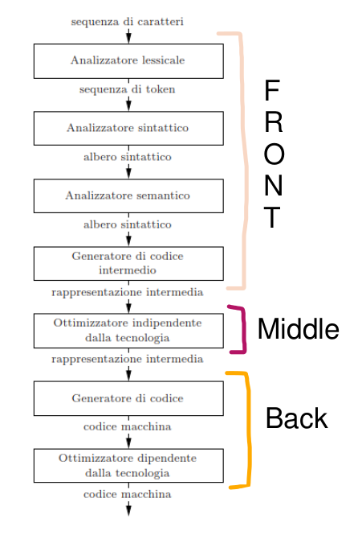
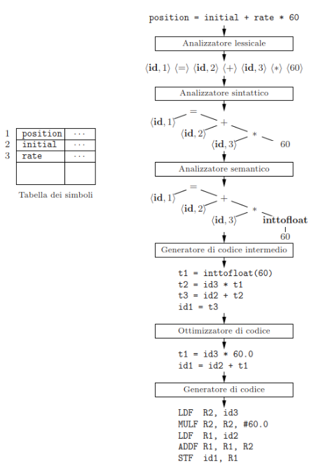
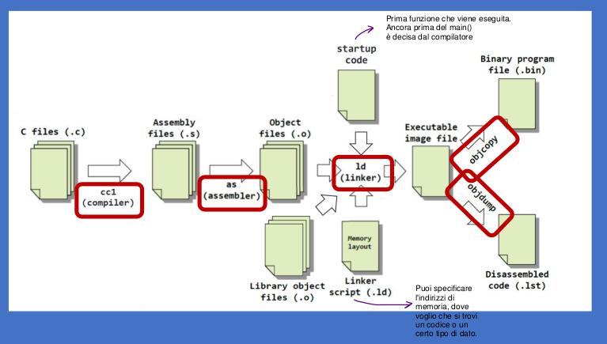
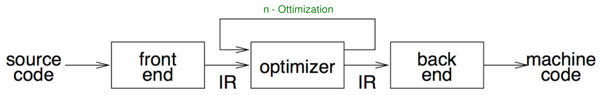
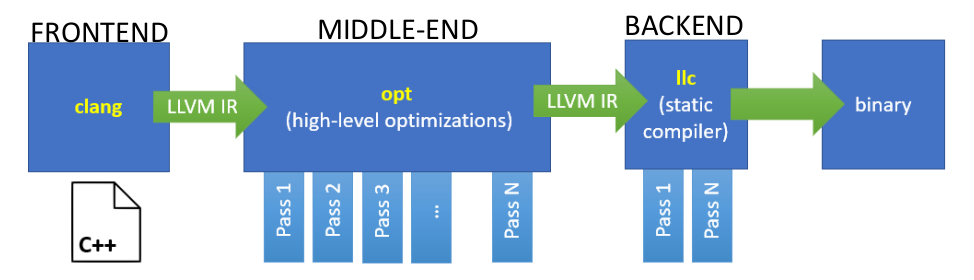
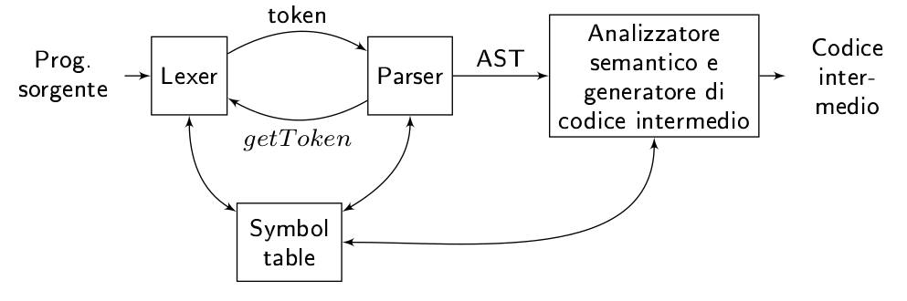

# My First LLVM Compiler

In this repository you can find the implementation of a compiler.  
The compiler is divided into <b>Front-End</b> and <b>Middle-End</b>.  
The <b>Back-End</b> part is not implemented 🚫 

## Introduction

### What is the purpose of a compiler?

A compiler translates code written in a high-level programming language into machine code that a computer can understand. In more detail, a compiler is a special type of software that serves as a translator between the programmer and the computer.

### Anatomy of a compiler

<table>
    <tr>
        <td></td>
        <td></td>
    </tr>
</table>

### Compiler toolchain

</td>

 

## Dependencies ⚙️
The Front-End and Middle-End have different versions of LLVM and different dependencies.  
- Each project directory contains a README.md file that specifies the requirements.

 

## Middle-end 📁

In this directory you can find some optimizations on IR Code. 
Each optimization is made modifying LLVM source code or creating a new pass. 
 

_middle-end function:_

</img>

</img>

---

### Which optimizations or analysis?

#### Assignment1(optimization-LLVM)

- Algebric Identity.
- Strengh Reduction.
- Multi Instructions opt.

#### Assignment2(analiysis)

->Data Flow Analysis on three different case:

- Constant Propagation.
- Dominator Analysis.
- Very Busy Expressions.

#### Assignment3(optimization-LLVM)

- LICM (Loop Invariant Code Motion).

#### Assignment4(optimization-LLVM)

- LI (Loop Fusion).

  

## Front-End 📁

Given the following compilation stages:

</img>

In this part of the project, we will analyze and produce a working example of the first 4 phases (Front-End).
The phases are as follows:

1. Lexical analyzer.
2. Syntax analyzer.
3. Semantic analyzer.
4. Intermediate code generator.

 

<b>Front-End structure</b>

- <b>Lexer</b> is implemented using [Flex](https://github.com/westes/flex) (open source tool)
- <b>Parser</b> is implemented using [Bison](https://www.gnu.org/software/bison/) (open source tool)
- <b>Code generator</b> is implemented in a file .cpp called `driver.cpp`.

  

ℹ️ More details of the programming language implemented is on `/Front-End/Progetto_finale/`

